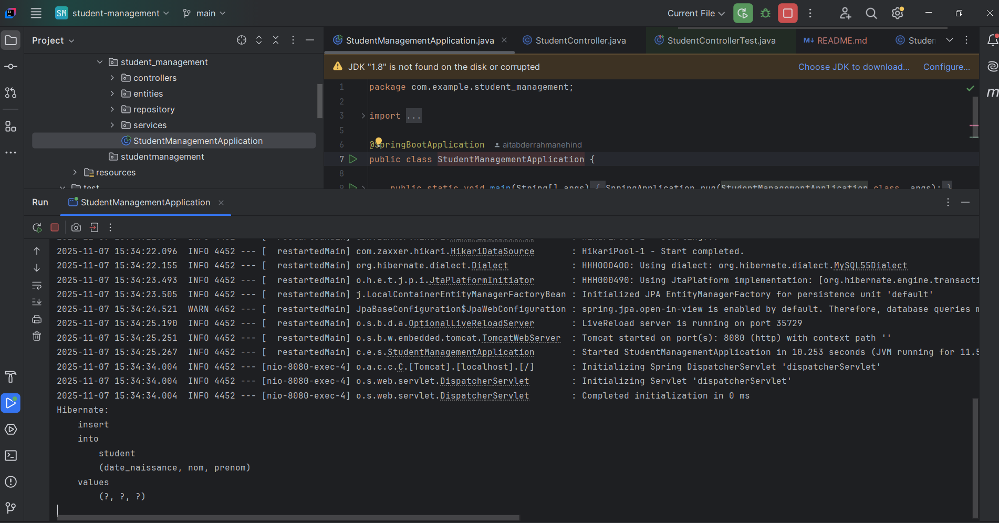

[img_4.png](img_4.png)    


# Student Management System

This project is a simple student management system built with Spring Boot. It provides RESTful APIs for managing student records, including operations such as adding, retrieving, updating, and deleting student information.

## Features

- Add new students
- View student details
- Update student information
- Delete students

## Technologies Used

- Spring Boot
- Java
- Maven
- H2 Database (in-memory for development)

## Getting Started

To run this project locally:

1. Clone the repository:
   ```bash
   git clone https://github.com/aitabderrahmanehind/Spring_Boot_Swagger
   ```
2. Navigate to the project directory:
   ```bash
   cd student-management
   ```
3. Build the project using Maven:
   ```bash
   ./mvnw clean install
   ```
4. Run the application:
   ```bash
   ./mvnw spring-boot:run
   ```

The application will start on port 8080 by default.

## API Endpoints

- `GET /api/students`: Get all students
- `GET /api/students/{id}`: Get student by ID
- `POST /api/students`: Add a new student
- `PUT /api/students/{id}`: Update an existing student
- `DELETE /api/students/{id}`: Delete a student

## API Testing with Postman

You can use tools like Postman or Insomnia to test the API endpoints. Import the API collection into your preferred tool and send requests to the defined endpoints to interact with the student management system.
